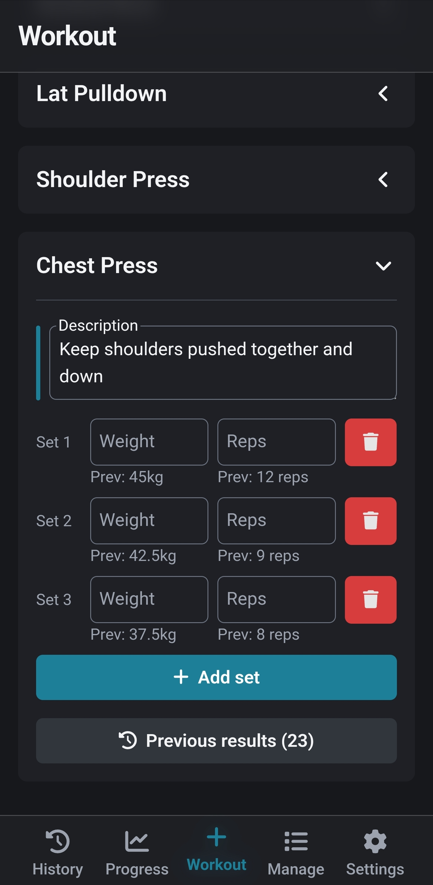

# Tracker

A comprehensive workout tracking application designed to help you monitor your fitness progress over time. This Progressive Web App (PWA) allows you to create, manage, and track your workouts with a user-friendly interface primarily made for mobile devices.



## Features

- **Workout Management**
  - Create and track workout sessions
  - Add exercises to workouts with customizable sets and reps
  - End or discard workouts as needed
  - View workout history with dates and exercise counts

- **Exercise Management**
  - Create and organize exercises with custom names and descriptions
  - Add optional nicknames to exercises for quick identification
  - Categorize exercises with tags (e.g., Chest, Back, Legs, Core)
  - View previous workout data when adding exercises

- **Progress Tracking**
  - Monitor your progress over time
  - View previous weights and reps for each exercise
  - Track workout frequency and consistency

- **Data Management**
  - Export your data for backup
  - Import previously exported data
  - Option to export data to the [Strong App](https://strong.app)
  - Add test data for demonstration purposes

- **User Experience**
  - Mobile-friendly responsive design
  - Light/dark mode support with system preference option
  - Offline functionality with PWA capabilities
  - Clean, intuitive interface

## Progressive Web App (PWA)

Tracker is built as a Progressive Web App, which means you can:

- Install it on your device like a native app
- Use it offline without an internet connection
- Get a fast, app-like experience
- Receive updates automatically

## Tech Stack

- **Frontend Framework**: React 18
- **Routing**: React Router v7
- **Styling**: TailwindCSS
- **Icons**: Font Awesome
- **Build Tool**: Vite
- **Storage**: Browser LocalStorage (client-side data storage)
- **PWA Support**: Service Workers

## Data Storage

Tracker uses the browser's LocalStorage to store all your workout data. This means:

- Your data stays on your device
- No server or internet connection required
- You can export your data for backup or transfer
- Data persists between sessions

## Project Structure

```
tracker/
├── public/             # Static assets and PWA resources
└── src/                # Source code
    ├── components/     # Reusable UI components
    ├── helpers/        # Utility functions
    ├── hooks/          # Custom React hooks
    ├── pages/          # Application pages
    └── App.jsx         # Main application component
```

## Prerequisites

- [Node.js and npm](https://nodejs.org/) (v16 or newer recommended)
- [Git](https://git-scm.com/) or [GitHub Desktop](https://desktop.github.com/)
- Modern web browser (Chrome, Firefox, Safari, Edge)

## Installation

### Clone the Repository

```bash
git clone https://github.com/stijnapp/tracker.git
```

### Navigate to the Project Directory

```bash
cd tracker
```

### Install Dependencies

```bash
npm install
```

## Usage

### Development Mode

Start the development server:

```bash
npm run dev
```

This will launch the application in development mode, typically at http://localhost:5173/

### Building for Production

Create a production build:

```bash
npm run build
```

> **Note**: Manual building is typically not necessary as deployment is handled automatically through GitHub Actions when changes are pushed to the main branch.

### Preview Production Build

Preview the production build locally:

```bash
npm run preview
```

## Deployment

The deployment is automated using GitHub Actions. The workflow file can be found at [`.github/workflows/deployment.yml`](.github/workflows/deployment.yml). Any **push** or **pull request** to the `main` branch will trigger the deployment.

The live version can be found at [stijnapp.github.io/tracker](https://stijnapp.github.io/tracker/).
